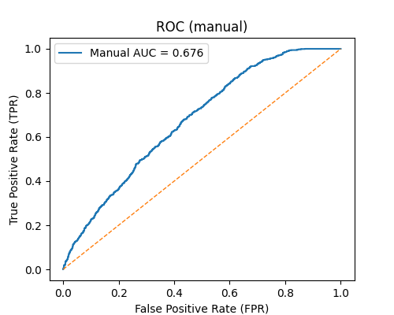
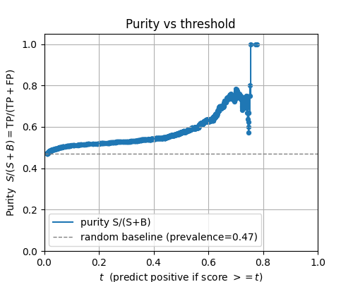
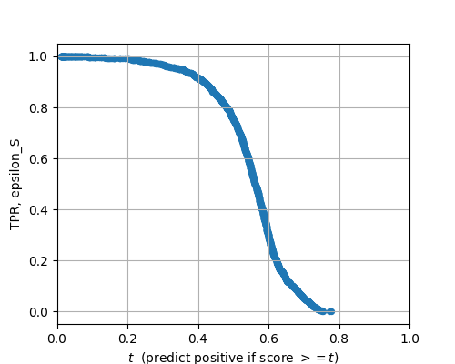
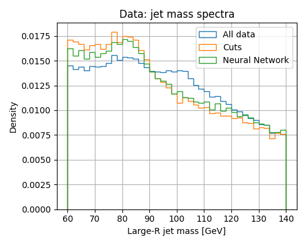
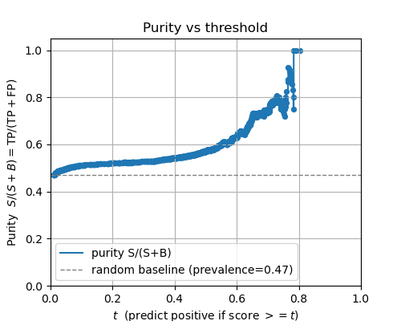

# Project documentation
by: Lena Emily Linsner, Marie-Philine Hebel & Martin Cloven
## Project discription
In our NN (Neural Network) we use both gathered ATLAS data and simulated data from particle collisions to predict whether gathered data does or does not originate from jets generated by W/Z bosons.

## General structure of used pytorch NN
To make a NN that predicts anything we use a neural structure with layers containing a number of neurons that are connected between each other. It starts at an input layer where each data point of a feature are handed into individual neurons and finishes with an output layer containg one neuron where the value of said neuron tells how certain the NN is of the result being either True or False.

The NN is trained by being given data which contains all relevant data points of the feature we want to analyze and True or False bool regarding if the data is corresponding to our desired event. The NN is initialized with "random" weight values for the connections between each neuron and then uses linear algebra between these weights to predict the values of the neurons in each layer. This allows us at the final layer to predict the likelyhood of our outcome being true or false for a given feature. If the NN predicts wrongly it observes how much each neuron inpacted the result and changes them according to severity (if they are very incorrect, they are changed alot and if they are less incorrect, they are changed less). This change is done by visualizing the NN as an "unknown" surface where the weights will be most reflective of the data at a minimum of said surface. Thus where the data is very wrong the weights will have a steeper gradiant towards a minimum and making the NN run multiple loops will allow the weights to fall into mimima and the NN will fairly reflect the patterns of the feature data that results in true and false results. 

Problems with gaining guess accuracy will occur depending largely on data quantity and quality, specific number of layer containg different number of neurons and number of epochs (training loops over data). There is no sure science to how many layers or neurons per layer to use to achive optimal results which makes tuning this variable more of an art. In general less layers with less neurons does not allow the NN to be complex enough to give accurate predictions. On the other hand more layers and neurons allows the NN to capture more details and nuances of the training data but does also make it easier for the NN to get over-trained. Over-training is when the NN does not capture the general structure required of data for it to correspond to a True or False guess but instead memorizes the answer to every example given in training, making it not able to correctly guess any other features than the ones given in training.

When calculating weights we multiply the significance of how each data point was for our result, how wrong our weights are when comparing with the data which gives us our gradient and then multiplying each gradient with a reasonable learning rate (step size for gradiant in each loop). If the input layer data points are not normalized, the NN will have to mathematically seperate the importance of each input data point when accounting for their scale and individual deviation which is very hard to accurately do. Thus normalizing all input data points around  this makes it very taxing for the program to decode how big the significance of each input data point is depending on their mean at 0 with a deviation of ±1 and with a learning rate of ex: 0.001 will greatly simplify the amount of calculations the NN needs to make per loop.

When updating all the weights with one data point at a time the weights themselves will move quite jittery and will take a long time to converge towards a minimum. To fix this jittery behavior we calculate the loss (deviation of prediction using data from truth) of many different points at the same time and then average out the resulting gradient change of each weight before multiplying this new sum with the learning rate. This change drastically increases accuracy of the steepness and direction of each gradient towards a minimum while lowering total computation time. 
When computing each epoch every batch (the group of points being calculated in parallel) will contain the same data points and will be computed in the same order of succession which greatly increases the risk of the NN to get over-trained. To avoid this, the training data can get shuffeled each epoch, making each batch and order of what data point gets calculated unique and thus eliminating some structural patterns that can result in over-training. 

In due time and after enough epochs, every NN will get over-trained. To then train the NN as much as possible before it gets over-trained we use an "early stop" that stops the NN training when we see that the NN guesses on some testing data does not become more accurate while the NN guesses on the training data keeps on getting more accurate. Another way to minimize overtraining is to introduce `nn.Dropout(0.1)` in between our hidden layers. It deactivates 10 % of the neurons at random which allows the system to not rely only on a few given neurons to find a result.

For the system to be able to account for patterns of non linear functions, activation functions are used when calculating the value of each neuron in our hidden layers (the layers between the initial and final layers). Two such activation functions are `nn.Sigmoid()` and `nn.ReLU()` where sigmoid makes new neuron values by $$ f(x)_{sig} = 1/(1+e^{-x}) $$ and ReLU has  $$ f(x)_{ReLU}=0 \text{ for x≤0 and } f(x)_{ReLU} = x \text{ for x>0.}$$ Here sigmoid makes each neuron be between 0 to 1 while ReLU allows for 0 to infinity but ReLU's cut for all sums under 0 will result in multiple neurons with a value of 0 which is not a problem in itself as such neurons have no impact on the final result.

The loss function which determines how inaccurate the weights are can be calculated by ex: `nn.BCEWithLogitsLoss()` or `nn.MSELoss()`. BCE "Binary Cross Entropy" takes in the True or False status from your data to then predict the probability of how likely the training data is to be true or false and MSE "Mean Square Error": $$ Error = \frac{1}{N} \sum_{i=1}^N(y_i-y_{i-pred})^2.$$ Here it should be noted that BCEWithLogitsLoss() always results in predictions between 0 and 1 while MSE can do the same if a sigmoid() is run right after. 

## Applying general rules of NN to our use case: 

As our goal is to predict the likelyhood of what jet originated from a W/Z boson we want to use `nn.BCEWithLogitsLoss()` as our `loss_function` and add on a `nn.ReLU()` between each hidden layer for good messure. We also choose to have two hidden layers with a `nn.Sequential(...)` structure of: $$ \text{Linear}(10 \rightarrow 32) \, \rightarrow \, \text{ReLU} \, \rightarrow \, \text{Dropout}(p=0.1) \, \rightarrow \,\text{Linear}(32 \rightarrow 16) \, \rightarrow \, \text{ReLU} \, \rightarrow \, \text{Linear}(16 \rightarrow 1).$$ As our input data we use the position of where the jet and leading lepton ended up at, their transverse momenta, and 3 calculations of said positions and momenta to get data containing desiered underlying patterns.

## The ROC curve 
The ROC curve is a measure of how effective a neural network is at differentiating between signal and bachground. It compares the True Positive Rate (TPR) - so the fraction of true positive signals to total number of signals - to the False Positive rate (FPR) - the fraction of background falsely interpreted as signal to the total number of background. 
The threshold is decreased at each step, leading to an increase of both true positives and false positives. If the Area Under Curve (AUC) is greater than 0.5, the neural network is better at differentiating between signal and background compared to random guessing. 

The ROC curve obtained from the implemented neural network can be seen below.

*Figure: ROC curve displaying the True Positive Rate (TPR) vs the False Positive Rate (FPR) for different thresholds. The diagonal dashed orange line shows the ratio for random guessing.*

Naturally, the ROC curve can only be obtained from simulated data, since the truth value needs to be known. The validation split from the Monte Carlo simulated data in the `pythia.csv` file was used. \
From this plot it can be seen that the employed model is able to discern signal from background with a certain accuracy.

## Purity versus threshold 
A different method to quantify the efficiency of a machine learning model is by observing the purity of a sample at different thresholds. \
The purity is defined as $$\text{purity} = \frac{S}{S+B} ,$$ 
where $S$ is the number of selected signals and $B$ the number of selected background. \
The purity with respect to threshold can be seen below.

*Figure: Purity of the validation split for different thresholds. The horizontal dashed line gives the purity for random guessing as a reference.*

Generally, a higher threshold will increase the purity with the cost of a smaller amount of selected signals. When trying to make a certain feature - like the large-R jet mass maximum at the vector boson mass - more distinct both a large amount of selected signals and a high purity are of importance. The threshold needs to be chosen accordingly, such that the sample is not too small to give a general distribution and that the purity is significantly greater compared to the baseline purity of the sample. \
The True Positive Rate (TPR $= \epsilon_S$) increases for a smaller threshold, as can be seen here:

*Figure: True Positive Rate (TPR $ = \epsilon_S$) plotted against threshold. A smaller threshold will give a larger TPR.*

The final mass spectrum was observed for different true positive rates and the clearest maximum at the vector boson masses was found for a TPR of $\epsilon_S = 0.7$. This corresponds to a threshold of $t^* = 0.517$. 

## Jet masses

To identify whether a jet originates from a hadronic vector boson decay $V \rightarrow q\bar{q}$ or from QCD background, we can look at the Large-R jet mass distribution. In the case of hadronic vector boson decay, the two quarks are collimated as one fat jet. Hence, we expect a peak around the masses of the $W$- and $Z$-bosons (80 and 91 GEV, respectively) in the jet mass distribution, which should sit on a falling background of QCD jets. \
This is exactly the strucure we can see in the histogram below.  

*Figure: Jet mass spectra for the original data (blue), cut-based selection (orange) and NN selection (green).*

When taking all data from `jets.csv` into account, the mass spectrum is mostly flat until approx. 105 GEV, and the peak
around the vector boson masses is only slightly visible. After applying the cuts $p_T(l) \geq 50$ GeV, $p_T(j) \geq 250$ GeV and $\Delta \phi (j,l) \geq 2.4$, we see a more enhanced peak and a reduced QCD background. \
After applying the neural network, we can observe a slight improvement to the cuts, as the peak around ~ 85 GeV gets somewhat more enhanced. Even though the improvement is small, this can be interpreted as successful learning of the NN. 

## MC purities 

To be able to judge the effectiveness of the NN, i.e. if it is "better" than the simple cuts for our purpose, we should compare the purities for NN and cut-based selections of `pythia.csv`. \
The results are: $$\text{purity NN: }0.577 \quad \quad \quad  \text{purity cuts: } 0.526$$ From this it can be argued that due to the improvement in the purity is the use of the NN is justified. 

# Adapting the Neural Network 

In the next step, the neural network has been changed by widening to: 10 $\rightarrow$ 64 $\rightarrow$ 32 $\rightarrow$ 1. The effects are discussed and illustrated below. All in all, the imporvements to ROC, AUC and purity are only marginal. However, the early stopping set in at 350, as compared to 488 with the original NN.  

## The ROC curve

Widening the NN changed the ROC curve only marginally, as shown in the figure below. It seems to be a bit more bulged in the region of FPR 0.6 - 0.7, but that cannot be clearly seen. The AUC improved marginally to 0.677 (vs. 0.676 with the original NN). 

*Figure: ROC curve and AUC for the adapted NN. A marginal improvement to the AUC can be observed.*

## Purity versus threshold 

Widening the NN as described leads to a higher purity vs. threshold between the scores of $t = 0.7$ to $t = 0.8$. Instead of the decrease that is observed with the original NN close to $t = 0.8$, one can now see an increase in this t-region. However, this does not seem to have any significant influence for our purposes, as the working point was again chosen as $t^* = 0.517$, with the same TPR as before. The purity vs. threshold curve as obtained with the adapted NN is illustrated in the figure below. 

*Figure: Purity vs. threshold for the adapted NN. An increase in purity is observed for thresholds between $t = 0.7$ and $t= 0.8$ compared to the original NN.*

## MC purities 

Comparing the purities of the orignal NN, the adapted NN and the cuts: $$\text{purity original NN: }0.577 \quad \quad \quad \text{purity adapted NN: }0.578 \quad \quad \quad \text{purity cuts: } 0.526$$ From this it becomes clear that there is an increase in purity when comparing the adapted NN to the original one. As for the AUC, this improvement is small.